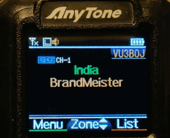

# DMR Code Plugs for India

You can download the DMR code plugs made for VU hams in particular, which includes the local repeater frequencies across India.

## Features

- BrandMeister, TGIF, YSF Talk Groups 
- All VU analog repeater frequencies
- OSCAR Satellite frequencies
- Echolink repeater node numbers in analog address book
- Channels grouped into zones that can be customized

## Code Plug details

### Channels

Channels are grouped in the range: Digital Channels for HS (1-99), Digital simplex channels (100-199), Analog/Digital repeater channels (200-299), Allstar HS channels (300-399), Satellite frequencies (400-499). You may find more channels than required here, but only the ones included in Zones are displayed in the radio.

### Zones

Zones are named as Network names, digital simplex channels, regional repeaters/simplex channels, satellite, Allstar, etc. This can be customized by removing the unwanted zones or adding more channels to each zones.

## Usage

### Download
Download the code plug for the required radio. Choose the file based on the radio model and the hotspot type. Note that the file name contains the following information:  
Hotspot type and frequency - e.g. UHF Simplex 434.500 MHz  
Radio Model - e.g. Anytone 878UV  

### Customize and program

1. Open the code plug in the CPS
1. Change the Radio ID and call sign (change 4040000 and VU1AAA)
1. Review Zones and make changes as needed
1. Review all the display, programmable key functions and change as needed
1. Program to the radio

## Available Code Plugs

|Radio Model|Firmware|File name|Link|
|---|---|---|---|
|AnyTone AT-D878UV |1.24N|4040000_uhf-sim-hs-434500000_878-v1.rdt|[Download](https://github.com/bejoysat/amateurradio/raw/master/digital/4040000_uhf-sim-hs-434500000_878-v1.rdt)|
|Alinco DJ-MD5|1.13e|4040000_uhf-sim-hs-434500000_dj5-fw1_13e-v1.rdt|[Download](https://github.com/bejoysat/amateurradio/raw/master/digital/4040000_uhf-sim-hs-434500000_dj5-fw1_13e-v1.rdt)|
|Alinco DR-MD500||||
