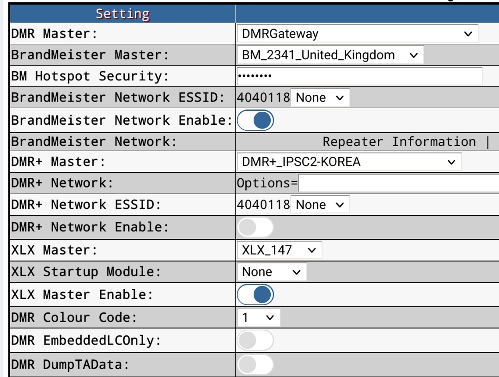

# Add XLX147(YSF India) to PI-star Hotspot

XLX147 is a multi protocol gateway reflector hosted in Chennai by VU3TBR Bala, that is connected to various modes like DMR, DSTAR, Peanut, Allstar, Echolink. Configuring this server in Pi-star will enable one to work with stations that use any of the modes mentioned above, using their radio. Follow the below steps for the configuration. DMRGateway allows one xlx server to be added out of 6 possible DMR networks. These steps are same for adding any xlx servers to Pi-star. 
## Enable DMR2YSF in Hotspot
1. Go to Configuration page in Hotspot 
1. In MMDVMHost Configuration section, enable DMR2YSF
1. Click Apply Changes
1. Once the page change is applied, a new section Yaesu System Fusion Configuration will be visible under the configuration page. Leave the settings under it unchanged.

## Enable DMR Gateway in Hotspot

1. Go to Configuration page in Hotspot 
1. In DMR Configuration section, select DMR Gateway as DMR Master 
1. Apply Changes. You will get the additional options as shown in the below picture. 
1. Enable BrandMeister Network (if not enabled). Select the BrandMeister Master.
1. Choose XLX147 as the XLX Master (Optional)
1. Enable XLX Master (Optional)
1. Apply Changes again. 
Note. There are no changes made to the existing DMR settings and the Hotspot /Radio will continue to work as before. Also each time a change is applied, enter the BM Hotspot Security password, and ensure that the "DMR Net" status on Dashboard screen is Green.

## Program Radio
There are two ways to work the YSF rooms.
### Method 1 (Recommended)
The following channels need to be programmed in the radio for working the YSF India server.
1. Name: __YSF India__ TG: __7008338__ (Group Call)
2. Name: __YSF Unlink__ TG: __7004000__ (Group Call)

Reference: http://www.pistar.uk/ysf_reflectors.php 

### Method 2
The following channels need to be programmed in the radio for working the YSF India server.
1. Save a contact XLX Connect as a Private Call to ID 64002. This is to connect to the YSF India Server. 
1. Save a contact XLX Disconnect as a Private Call to ID 64000. This is to disconnect from the YSF India Server.
1. Save a contact TG6 as public call to ID 6. This is the channel to have QSO on the YSF Server once connected.

## Operating on XLX server
Based on the method chosen above, follow the below procedure.
### Method 1 (Recommended)
First connect to YSF India by keying (short PTT) __YSF India__

Note: The connection can be confirmed by checking the Dashboard. __YSF Network status__ on left side will show __XLX147__

Talk using the same channel __YSF India__

Disconnect the server using __YSF Unlink__
### Method 2
This method needs optional settings above needs to be enabled.
First connect to YSF India by keying (short PTT) XLX Connect

Change to TG6 and operate. The audio will be routed to YSF India server. Other stations (connected via peanut) on this channel can be heard to. 

The DMR traffic from BrandMeister will also available during this time. 

When done with qsos disconnect by PTTing XLX Disconnect. This step is optional.
## YSF India dashboard 
Server dashboard can be viewed at http://ysf-india.ddns.net/

### Revision history
12/05/2021 VU3BOJ Initial revision

23/01/2022 VU3BOJ Updated program radio section
